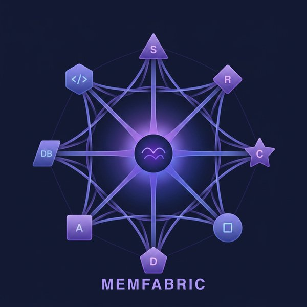

# MemFabric

<p align="center">
  
</p>

<p align="center">
  <strong>One memory layer for every agent.</strong>
</p>

<p align="center">
  <a href="README_CN.md">中文文档</a> ·
  <a href="#quick-start">Quick Start</a> ·
  <a href="#tools">Tools</a> ·
  <a href="#architecture">Architecture</a>
</p>

---

MemFabric is the **cross-agent memory infrastructure** — a unified memory fabric shared by all AI agents. Switch agents like switching phones: your data follows you.

## Why MemFabric?

Every AI agent today (Claude Code, Cursor, Codex, Hermes, OpenClaw...) has its own memory system. Your coding agent learns your preferences, your personal assistant remembers your schedule, but **they never share**. You have fragmented memories scattered across different tools.

MemFabric solves this: **one memory layer, any agent**.

```
Before:                               After MemFabric:

Agent A ──→ Memory A (isolated)       Agent A ──┐
Agent B ──→ Memory B (isolated)       Agent B ──┤
Agent C ──→ Memory C (isolated)       Agent C ──┼── MemFabric ──→ Unified Memory
Agent D ──→ Memory D (isolated)       Agent D ──┤
Agent E ──→ Memory E (isolated)       Agent E ──┘
```

## Key Features

- **Cross-Agent Memory** — Write once, read from any agent. Namespace isolation with configurable sharing.
- **MCP Protocol** — Standard MCP server, works with any MCP-compatible agent out of the box.
- **Zero Ops** — stdio mode: agents launch MemFabric as a child process. No server, no daemon, no config.
- **Append-Only Event Log** — Every memory mutation is immutable and traceable. Complete audit trail.
- **Hybrid Search** — Vector semantic search + keyword matching with configurable weights.
- **Causal Lineage** — Every memory carries its full modification history: who changed what and when.
- **Conflict Detection** — Detect when multiple agents modify the same memory concurrently.

## Quick Start

### Install

```bash
pip install memfabric
```

### Connect Your Agent

Add to your agent's MCP config (all major agents supported):

**Claude Code** (`.mcp.json`):
```json
{
  "mcpServers": {
    "memfabric": {
      "command": "python3",
      "args": ["-m", "memfabric.server"]
    }
  }
}
```

**Codex, Cursor, Windsurf, Gemini CLI, Copilot CLI** — same MCP stdio pattern. See [configs/](configs/) for all examples.

### Start Using

Once connected, your agent automatically has 6 new memory tools:

```
You: "Remember that I prefer dark mode in all my editors"

→ Agent calls memory_add(key="pref-dark-mode",
    value="User prefers dark mode in all editors",
    tags=["preference", "ui"])
```

```
You: "What did I say about my editor preferences?"

→ Agent calls memory_search(query="editor preferences dark mode")
→ Returns: "User prefers dark mode in all editors" (score: 0.94)
```

```
Agent A (Claude Code) stores: "api-endpoint = https://api.example.com/v2"
Agent B (Hermes, on Telegram): "What API endpoint do we use?"
→ Agent B searches shared namespace, finds the endpoint
```

## Tools

| Tool | Description |
|------|-------------|
| `memory_add` | Write a memory entry with key, value, tags, and namespace |
| `memory_search` | Hybrid search (vector + keyword) across readable namespaces |
| `memory_get` | Fetch a specific memory with full modification lineage |
| `memory_link` | Create relationships between memories (build knowledge graph) |
| `memory_recall` | Context-aware recall of relevant memories |
| `memory_forget` | Soft-delete a memory (history preserved for audit) |

## Architecture

```
┌──────────────────────────────────────────────────┐
│                 User's Machine                     │
│                                                    │
│  Claude Code ──┐                                  │
│  Cursor ───────┤                                  │
│  Codex ────────┼── stdio (MCP) ──→ MemFabric       │
│  Hermes ───────┤    no network                    │
│  OpenClaw ─────┘    no daemon                     │
│                                                    │
│  ~/.memfabric/                                     │
│  ├── store.db       ← SQLite append-only log       │
│  ├── vectors/       ← ChromaDB semantic index      │
│  └── config.yaml    ← namespace sharing policies   │
└──────────────────────────────────────────────────┘
```

## Data Model

All memory is stored as an **append-only event log**:

```sql
CREATE TABLE events (
    event_id    TEXT PRIMARY KEY,
    agent_id    TEXT NOT NULL,        -- which agent wrote this
    namespace   TEXT NOT NULL,        -- isolated memory space
    key         TEXT NOT NULL,        -- memory identifier
    value       TEXT NOT NULL,        -- memory content
    operation   TEXT NOT NULL,        -- add | update | link | forget
    parent_event_id TEXT,             -- previous version (causal chain)
    tags        TEXT,                 -- JSON array
    created_at  TEXT NOT NULL         -- microsecond precision
);
```

## Namespace Model

Each agent has its own namespace (`agent:<id>`). Two built-in shared spaces:

| Namespace | Visibility |
|-----------|------------|
| `agent:<id>` | Private to that agent |
| `shared` | Read/write by all agents |
| `default` | Read/write by all agents |

Configure sharing policies in `~/.memfabric/config.yaml`.

## Configuration

```yaml
# ~/.memfabric/config.yaml
max_entry_chars: 2200       # max chars per memory entry
max_search_results: 8       # results per search
min_search_score: 0.35      # minimum relevance score
vector_weight: 0.7          # vector vs keyword weight
text_weight: 0.3
default_namespace: default
```

## Design Philosophy

MemFabric is **not** another agent framework. It's the **data layer** for the agent ecosystem.

- **Shovel seller strategy**: Whoever wins the agent framework war, they all need memory infrastructure.
- **Auditable by default**: append-only log, complete causal chain.
- **Privacy-first**: data stays on your machine. Encryption optional.
- **Zero lock-in**: MCP standard. Any agent can connect or disconnect freely.

## Comparison

| | Agent Memories (built-in) | MemFabric |
|---|---|---|
| **Scope** | Single agent only | **Cross-agent** shared memory |
| **Protocol** | Proprietary per framework | **MCP standard** — any agent |
| **Governance** | None | **Append-only lineage** — auditable |
| **Conflicts** | None | **Multi-source detection** |
| **Portability** | Locked to one agent | **Switch agents, keep memories** |

## License

MIT

---

<p align="center">
  <sub>Built for the multi-agent era. One memory fabric, infinite agents.</sub>
</p>
